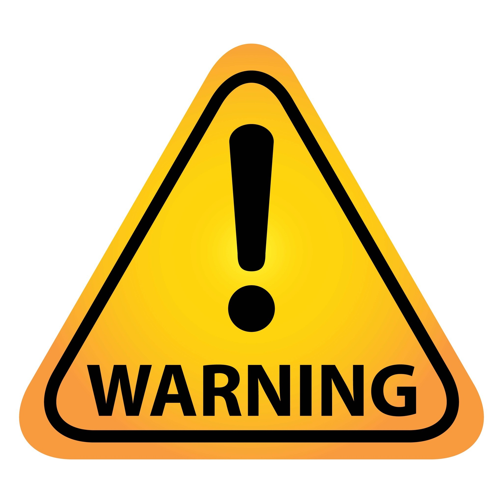

You’re the product.

Social media is a new kind of exploitation. While companies or businesses used to capitalize on labor or natural resources to turn a profit, this new industry exploits a totally new resource to make money: personal data from its users. 

Social media platforms invest in massive research projects to refine the algorithms they use to organize and show content. For platforms like YouTube or Instagram, their algorithms can use billions and billions of user data points to get better at showing you content they think you’d like to see based on what you’ve already seen. Oh, and as private corporations, they do all of this for profit, and without much government oversight or regulation.

They do all of this for one simple reason: to keep you hooked, long past the time you swore you’d put down your phone and do something meaningful. Each tap or swipe is another nibble of useful data for them. At the same time, every “like” or “share” on your own TikTok or Insta posts sends a little hit of dopamine to your brain, and the cycle continues. You might even blame yourself and your lack of discipline for all that wasted screen time, too. You’ll vow never to mindlessly scroll again, but spoiler alert: you will. 

The trend only got worse with the rise of portable devices like smartphones and tablets. Now users could offer up their data 24-7, wherever they went. So from attending a work meeting, paying bills, swiping on Tinder or calling your Mom, your participation in much of life now happens  through a single device. 

Since everything is online these days – from job portals to dating sites – you’re encouraged to think of yourself along these same lines. No more applying for a position or wooing a love interest. Market yourself to employers or partners so they’ll smash that like button. Don’t have a personality, have a profile—without quirks, surprises, contradictions, or mysteries. 

And so, given that life is more complicated than a hashtag, you have to diminish yourself to fit the algorithm. When this becomes easy, you might forget that there are other humans out there who interpret the me you put out online. While a heated Facebook debate might seem harmless, online arguments now spill over into the rest of life—dividing families, polarizing politics, and costing real lives. 

As you watch the world through your device, your device can watch you, too. The internet also functions as a new form of global surveillance, with smart devices listening in to homes, cars, workplaces and schools. They can track where you go and who else is there, even how many steps you took along the way.

So, next we’ll take on some of the biggest myths surrounding the internet, and a few of its dark realities. We’ll look for the roots of the online revolution in history, biology, philosophy and mathematics– in order to uncover how we got into this mess, and what we have to do to get out. 

